# 🌍 TravelScope - Smart Travel & Tourism Platform

A full-stack web application built using **Flask**, **PostgreSQL**, **HTML**, **CSS**, and **JavaScript** that helps users explore countries, cities, restaurants, weather forecasts, interactive maps, and travel booking services through an engaging and user-friendly platform.

---

# 📖 About

TravelScope is a travel and tourism platform designed to make trip planning easier by providing destination information, city exploration, restaurant recommendations, weather forecasts, interactive maps, and travel booking interfaces in one application.

The application combines a responsive frontend with a Flask backend and PostgreSQL database to deliver dynamic travel information and location-based services.

---

# ✨ Features

- 🌍 Explore Countries
- 🏙️ Browse Cities
- 📖 Detailed Destination Information
- 🍽️ Restaurant Recommendations
- 🌤️ Live Weather Forecast
- 🗺️ Interactive Maps
- ✈️ Flight Booking Interface
- 🏨 Hotel Booking Interface
- 📍 Geolocation Services
- 🗄 PostgreSQL Database Integration

---

# 🌟 Project Highlights

- Full Stack Web Application
- Flask Backend
- PostgreSQL Relational Database
- Dynamic Destination Explorer
- Weather API Integration
- Interactive Maps
- Travel Booking Interface
- Responsive User Interface
- Modular Project Structure

---

# 🛠 Tech Stack

## Frontend

- HTML5
- CSS3
- JavaScript

## Backend

- Python
- Flask

## Database

- PostgreSQL
- Psycopg2

## APIs & Libraries

- OpenWeather API
- Geopy
- Requests
- Leaflet.js
- Font Awesome
- Git
- GitHub

---

# 🚀 Main Modules

### 🌍 Country Explorer

Browse available countries with destination images and descriptions.

### 🏙️ City Explorer

Explore cities within each country along with travel information.

### 🍽️ Restaurant Guide

Discover restaurants, descriptions, pricing, and navigation links.

### 🌤️ Weather Dashboard

View real-time weather conditions and forecasts for selected cities.

### 🗺️ Interactive Map

Locate destinations using an interactive map with geolocation support.

### ✈️ Flight Booking

Flight reservation interface for planning trips.

### 🏨 Hotel Booking

Hotel booking interface for accommodation planning.

### 🔧 Admin Panel

Manage countries, cities, and restaurant information.

---

# 💾 Database

The application uses PostgreSQL to manage:

- Country Information
- City Information
- Restaurant Information
- Country–City Relationships
- City–Restaurant Relationships
- Destination Images

---

<p align="center">
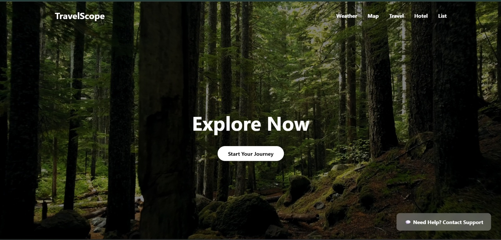
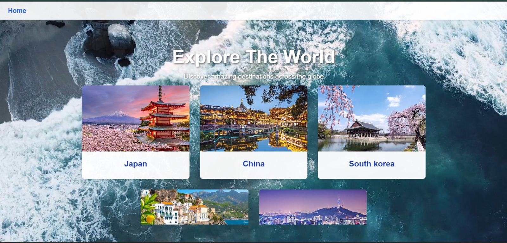
</p>

<p align="center">
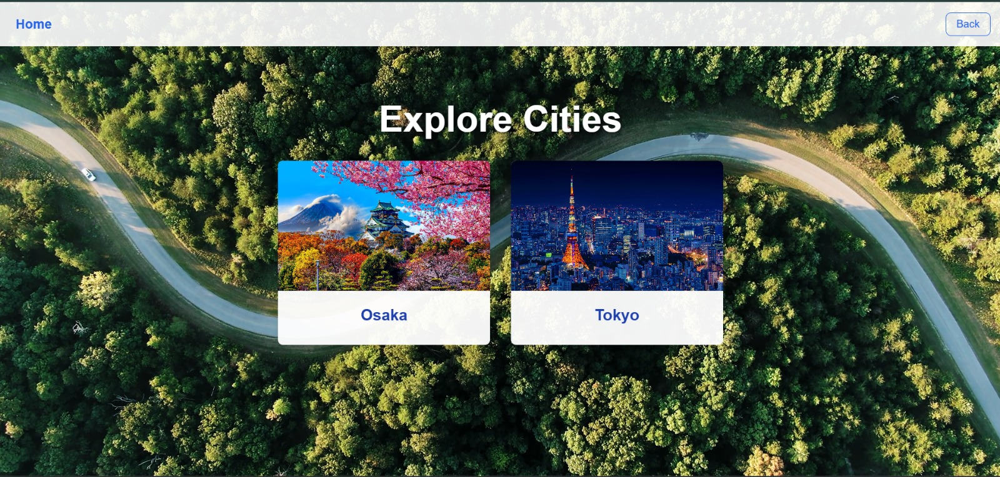
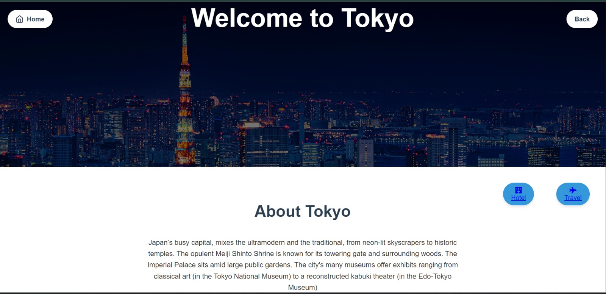
</p>

<p align="center">
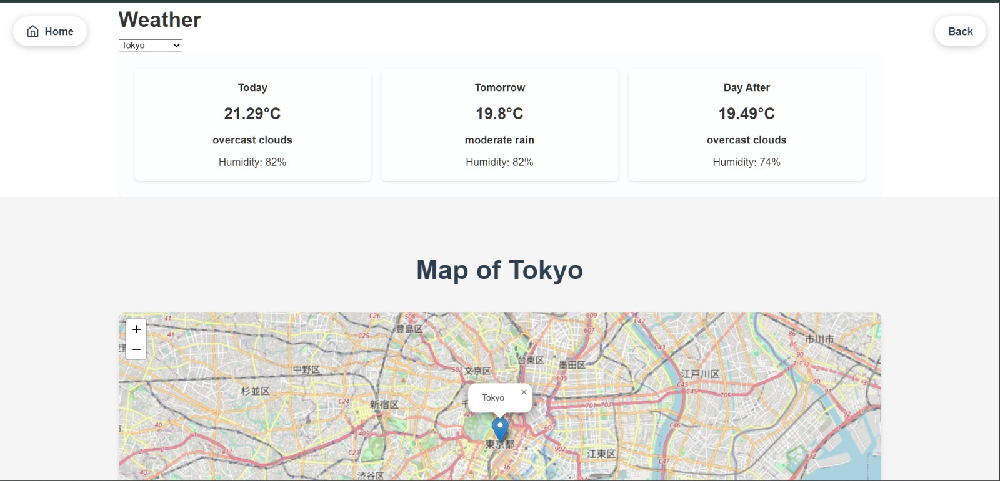
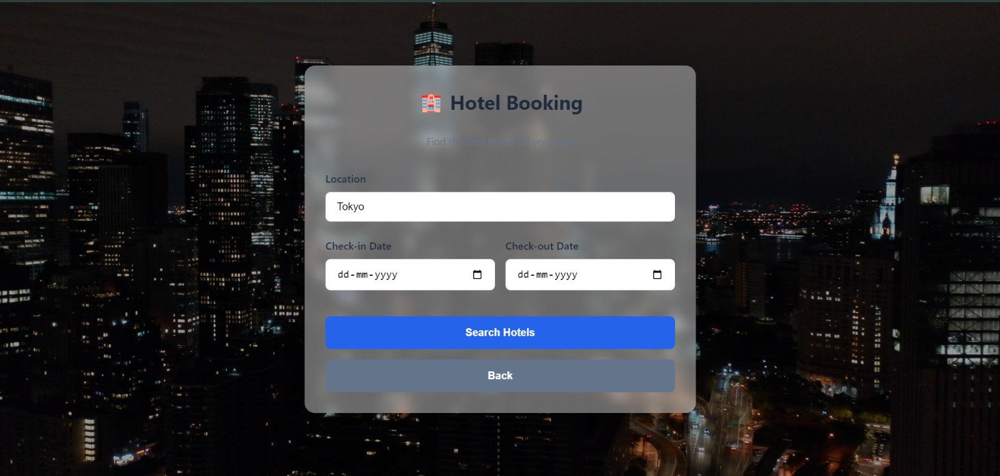
</p>

<p align="center">
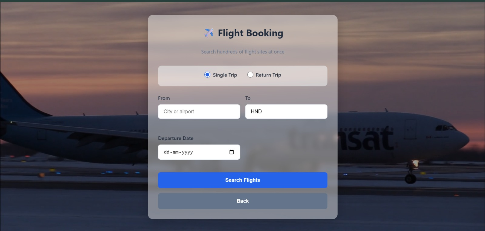
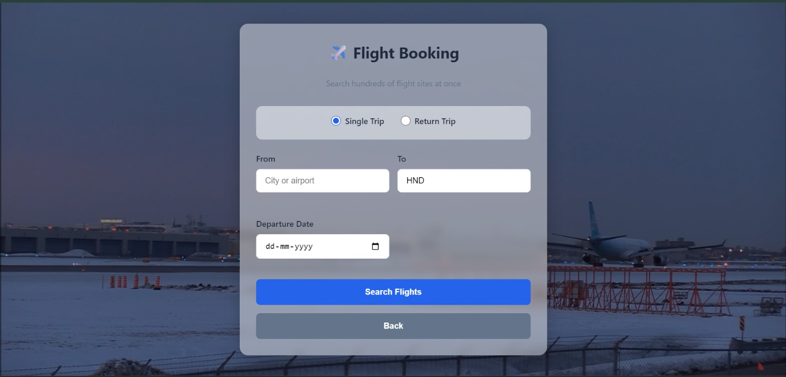
</p>

<p align="center">
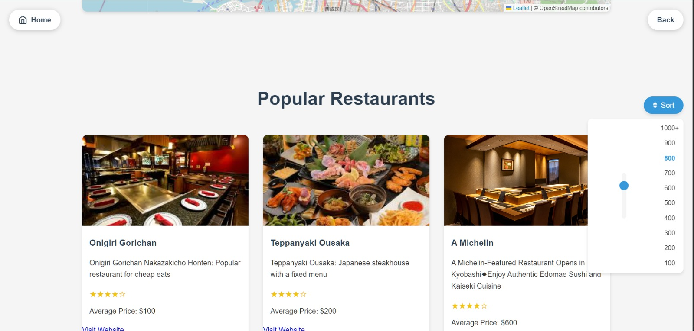
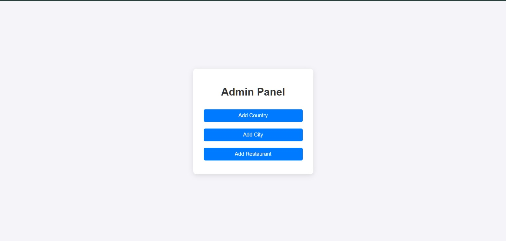
</p>

<p align="center">
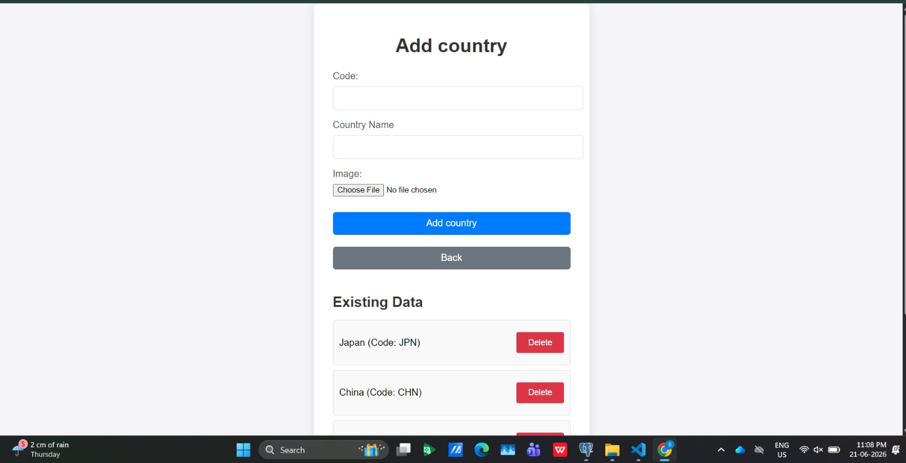
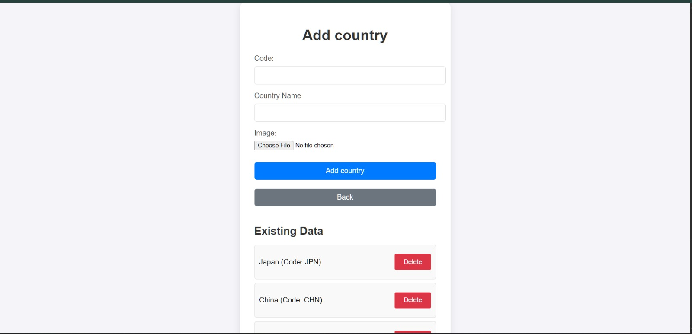
</p>

---

# 📂 Project Structure

```text
TravelScope/
│
├── Screenshots/
├── templates/
├── app.py
├── requirements.txt
├── README.md
└── .gitignore
```

---

# ⚙️ Installation

Clone the repository

```bash
git clone https://github.com/SHIV0V/TravelScope.git
```

Move into the project folder

```bash
cd TravelScope
```

Install dependencies

```bash
pip install -r requirements.txt
```

Configure PostgreSQL

Update the PostgreSQL credentials inside `app.py`.

```python
user=""
password=""
host=""
dbname="postgres"
port=""
```

Configure OpenWeather API

```python
API_KEY="YOUR_API_KEY"
```

Run the application

```bash
python app.py
```

---

# 🗄 Database Architecture

The application uses a **PostgreSQL relational database** to efficiently manage countries, cities, restaurants, and their relationships. Images, descriptions, travel information, and destination mappings are stored within the database to support dynamic content throughout the application.

```text
                    PostgreSQL Database
                           │
      ┌────────────────────┼────────────────────┐
      │                    │                    │
      ▼                    ▼                    ▼
  country               city              restaurant
      │                    │                    │
      └──────────────┬─────┴────────────────────┘
                     │
                     ▼
                  relation
                     │
     Links Countries ↔ Cities ↔ Restaurants
```

## Database Connectivity

The backend connects to PostgreSQL using **Psycopg2**. SQL queries retrieve country, city, and restaurant information which is then rendered dynamically through Flask templates.

### Database Workflow

```text
User
   │
   ▼
Frontend (HTML • CSS • JavaScript)
   │
   ▼
Flask Backend (app.py)
   │
   ▼
Psycopg2
   │
   ▼
PostgreSQL Database
```

## Database Tables

| Table | Purpose |
|--------|---------|
| **country** | Stores country names, descriptions, images, and country codes. |
| **city** | Stores city information, descriptions, destination images, and airport codes. |
| **restaurant** | Stores restaurant information, pricing, images, descriptions, and navigation links. |
| **relation** | Connects countries, cities, and restaurants using relational mapping. |

### Database Features

- Relational database design using PostgreSQL
- Country–City relationship management
- City–Restaurant relationship mapping
- Binary image storage
- Dynamic destination retrieval
- Travel information management
- Scalable relational architecture

---

# 💡 Skills Demonstrated

- Full Stack Web Development
- Flask Framework
- PostgreSQL Database Design
- Relational Database Modeling
- REST API Integration
- Weather API Integration
- Geolocation Services
- Interactive Maps
- Backend & Frontend Integration
- Responsive UI Development

---

# 🚀 Future Enhancements

- User Authentication
- Travel Wishlist
- Destination Reviews & Ratings
- AI Travel Recommendation
- Expense Planner
- Online Flight & Hotel Integration
- Cloud Deployment
- Mobile Responsive Design

---

# 👨‍💻 Developer

**Shiv.V**

---

## 📄 License

This project is intended for educational purposes.
